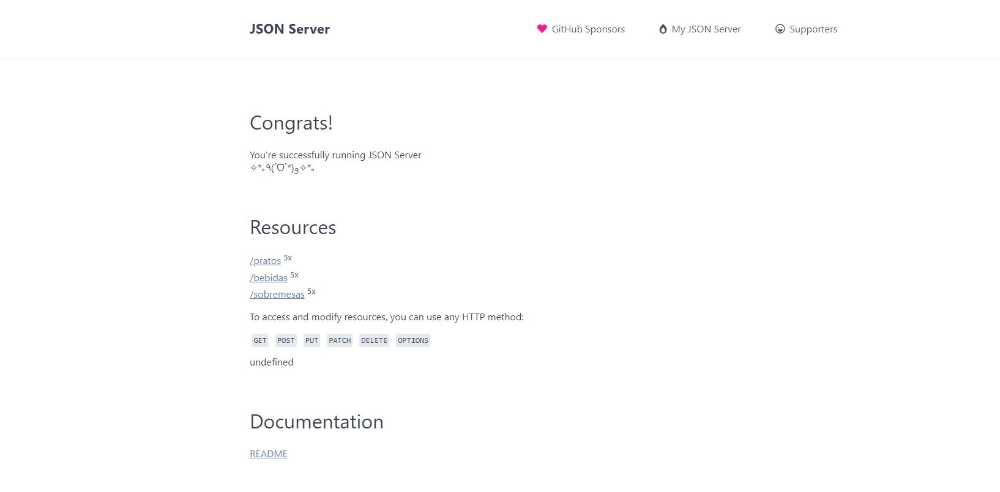

<h1> JSON-SERVER- API FAKE </h1>

  

  <h2> <b> Proposta:</b> </h2>
  
Desenvolver um servidor json (Json-server) onde irá conter 3 rotas com 4+ dados nas quais o usuário poderá realizar o GET, POST, PUT, DELETE.

 
<h2> <b> Como foi feito o projeto:</b> </b></h2>

 GITHUB: Criar repositório. 

 GITHUB DESKTOP: Editar/atualizar o repositório. 

 NODE.JS: Instalação do pacote npm, yarn e json-server. 

 VSCODE: Edição da pasta db.json. 

 RENDER: Criação da url da API. 

 POSTMAN: Testar metódos GET, POST, PUT e DELETE. 

